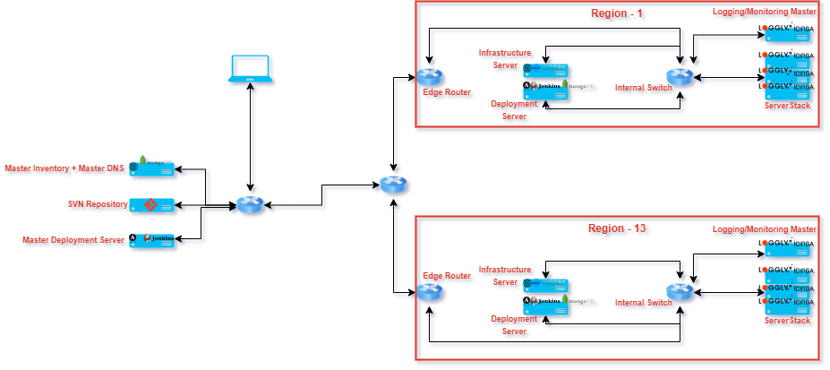
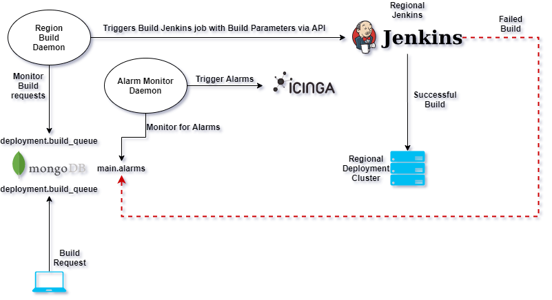

# Infrastructure Platform

Present Infrastructure Platform and it's segregations:

- Active Regions of Operations/Datacenters : **13**
- Server Class Segregations : **QA**, **Dev**, **Sim**, **DB**, **Prod Infra**, **Prod Trade**
- Server Attributes : **Clustered Cross Host Dependent Applications/Services**, **Present IPs**, **Native LVM**, **Co-located**
- Accessibility to Server Console (iLO/DRAC/Custom Console) : **iLO**,**DRAC**,**iKVM**
- Present Monitoring and Reporting System : **Passive Monitoring**
- Existence of **"any"** inventory system : Not Present, Currently maintained using **EXCEL Workbooks**
- Repository in use at present (Self Hosted/Private Online Repository) : **Self Hosted**
- Build Process bring followed now : local `make` & `build`
- Any Present Visual Inventory Dashboards : Not Available

## Proposed HLD:

> **Region(s) 1...13:**
- **Server Stack** - Monitoring + Log aggregator
- **Logging + Monitoring Master node** for respective Region
-** Infrastructure Server** Providing **DHCP**,**DNS**,**Cobbler** Services for respective Region
- **Deployment Server** Providing **Deployment**, **Configuration Management** and **Replicaset** for **Inventory**

> **Centralised Control Region**
- Self Hosted SVN Repository
- Master Dependent Server
- Master Inventory + Master DNS

## Setup Centralised Control Region:

The **Central Control Region** will be used a single point of contact for all Configuration Management, Fault Management, Performance Management, Version Control System and Deployment across all the regions. 
This will entrail **7** benefits:

1. **Reduce Interaction with actual compute nodes**, thereby reducing human error
2. Central, Indexed and Segregated **Configuration Management Data Source**
3. Effective **DNS** and **IPAM**
4. Ease of **Administration**
5. **Centralised** accumulation of **Fault** and **Performance** **Metrics** from across the regions
6. One Stop Access to **Deployment**
7. **Segregate and load balanced hierarchy** to ease scaling out Infrastructure 

**Project Segregations for setting up Centralised Control Region:**

> **Kicktart and Configure 2 Rack Servers** :
* **Target** : Provision Rack Servers to use Xen Project Hypervisor (version 4.10.0):
* **Requirements**:
  * **Infrastructure**: 3 Rack Servers: HP DL20/DELL R240 (2x2nd Gen Xeon/128GB/512GB PCIE nvme SSD), Xen Project Hypervisor version 4.14.0
  * **Resource**: 2x Linux Sysadmin
* **Timeline** - 2 Sprints (2x10 days)

> **Configure Virtual Machines on Xen** :
* **Target** : Create Virtual Machine, Configure LVM, Install and Configure respective Packages:
    * Create 2 Virtual Machine Per Host
    * Install OS (CentOS 8), configure LVM and set up networking
    * Set up local Repositories and Mirrors
    * Configure and Install Services:
        * Inventory and DNS Server: Nixu Namesurfer (IPAM) in 1 VM in Inventory and DNS Server
        * Deployment Server: Jenkins, Ansible
* **Requirements**:
    * Infrastructure: Nixu Namesurfer, Ansible, Jenkins, CentOS 8 x86_64
    * Resource: 2x Linux Sysadmin, 1x Network Admin, 1x pgsql DBA
* **Timeline**: 1 Sprint (10 days)

## Inventory:

Inventory is one of the **key** drivning factors in any organic IT Infrastructure, it serves as an address book and as an updated information store house for all the elements in the Infrastructure, which represents a platform similar to a CMDB.

**Project Segregations for the Overhaul of Inventory System:**

> **Install And Configure MongoDB**:
* **Target**: Install and Configure MongoDB as Replicaset to provide the datastore for inventory
    * Install MongoDB and configure replication on 1 VM in Inventory and DNS Server
    * Create Users and Databases in MongoDB:
        * Users - dba(CRUD), support(RU), sre(CRUD)
        * DB - main, cluster, deployment, baremetal, capacity, misc
        * Collections:
            * main.db - groups, ports, instance, ip, region_capacity, alarms 
            * cluster.db - cluster_all, cluster_qa, cluster_dev, cluster_sim, cluster_DB, cluster_infra, cluster_trade  
            * deployment.db - build_queue, delete_queue, workers
            * baremetal.db - bricks, bricks_active, bricks_decommed
            * capacity.db - cluster_capacity, brick_capacity
* **Requirements**:
    * Infrastructure: MongoDB, Stunnel
    * Resource: 1x Linux Admin, 1x MongoDBA
* **Timeline**: 1 Sprint (10 days)

> **Export, Create and Restore Existing Ivnentory from excel to MongoDB**:
* **Target**: Export Existing Inventory from Excel, Create respective mongo docs/json, Restore docs/json to previously setup Mongo Inventory
* **Requirements**: 2x Engineer, 1x MongoDBA
* **Timeline**: 2 Sprint (2x 10 days)

> **Test Efficacy of the inventory setup**:
* **Target**: Test the Efficacy of the inventory in terms of iops, stability and scalability
* **Requirements**: 1x Linux Admin, 1x MongoDBA

## Setup Infrastructure Wide Upgrades:

After the **Central Control Region** is setup, the changes on the regional counterparts needs to be made, to facilitate seamless transition and logic flow and control in the specific regions:

> **Setup Infrastructure, Deployment and Logging Servers in the respective Regions**:
* **Target** : Provision 3 Rack Servers to use Xen Project Hypervisor (version 4.10.0) per region:
* **Requirements**:
  * **Infrastructure**: 3 Rack Servers: HP DL20/DELL R240 (2x2nd Gen Xeon/128GB/512GB PCIE nvme SSD), Xen Project Hypervisor version 4.10.0
  * **Resource**: 2x Linux Sysadmin
* **Timeline** - 3 Sprints (2x 10 days)

> **Configure Virtual Machines on Xen** :
* **Target** : Create Virtual Machine, Configure LVM, Install and Configure respective Packages:
    * Create 2 Virtual Machine Per Host
    * Install OS (CentOS 8), configure LVM and set up networking
    * Set up local Repositories and Mirrors
    * Configure and Install Services:
        * Inventory and DNS Server: Nixu Namesurfer (IPAM) & DHCP in 1 VM, Cobbler in 1 VM
        * Deployment Server: Jenkins in 1 VM, Ansible and MongoDB in 1 VM
        * Logging Server: Icinga Secondary in 1 VM, Loggly/ElasticSearch in 1 VM 
* **Requirements**:
    * Infrastructure: Nixu Namesurfer, Ansible, Jenkins, CentOS 8 x86_64, Cobbler, dhcpd, MongoDB, ElasticSearch/Loggly, Icinga
    * Resource: 3x Linux Sysadmin, 1x Network Admin, 1x pgsql DBA, 1x MongoDBA, 2x Engineer 
* **Timeline**: 4 Sprint (4x 10 days)

> **Configure DNS and Replication**:
* **Target** : 
    * Create Respective DNS Entries in Nixu Namesurfer in **Central Control Region**
    * Setup DNS Propagation from **Central Control Region** to the respective secondaries in each zone
* **Requirements**:
    * Resource: 2 Linux Engineer, 1 Network Engineer
* **Timeline**: 2 Sprint (2x 10 days)

> **Ansible-ize "all" baremetal servers**
* **Target** : Exchange ssh keys to all baremetal servers with Master Deployment Servers in **Central Control Zone**
* **Requirements**:
    * Resource: 2x Engineer
* **Timeline**: 1 Sprint (10 days)

> **Install and Configure MongoDB Replicasets for inventory in Deployment Servers**
* **Target**:
    * Install MongoDB in 1 VM in Deployment Servers
    * Configure MongoDB as a Replicaset for the Master Inventory
    * Test the Replicasets
* **Requirements**:
    * Resource: 1x Linux Admin, 1x MongoDBA
* **Timeline**: 1 Sprint (10 days)

> **Create DHCP zones and set up Cobbler**
* **Target** :
    * Create respective DHCP groups
    * Setup Cobbler (System Profiles, Zones, Kickstart Files)
* **Requirements**:
    * ResourceL 1x Linux Sysadmin
* **Timeline**: 1 Sprint (10 days)

## Setup Logging and Monitoring

Logging and Monitoring are 2 vital components to understand and keep in check the health, prowess, and efficacy of any infrastructure or services. Here we are going to set up Monitoring using Icinga (Icinga is wrapper around a nagois core), and ELK/Loggly for log digestion and representation.
The usage of a logging tool allows us to fetch log entries (syslog/application log/network log) from all the hosts, without us having to login to the nodes per se

> **Set Up Logstash and ElasticSearch**
* **Target**:
    * Install Logstash on each of the nodes to aggregate syslog, application log, network log
    * Install ElasticSearch on 1 VM and Install Icinga on 1 VM in Regional Logging+Monitoring Master
    * Configure Logstash and ElasticSearch
    * Install Kibana on SVN Server in a separate VM in Master Deployment Server
    * Configure ElasticSearch and Kiabana
    * Create Dashboards
* **Resource**: 2x Linux Sysadmin, 1 DBA
* **Timeline**: 3 Sprint (3x 10 days)

> **Set Up Icinga**
* **Target**:
    * Install Icinga on all the nodes
    * Setup Icinga to collect appropriate metrics, and generate alterts based on threshold
    * Test Monitoring and Alerting
* **Resource**: 2x Linux Sysadmin
* **Timeline**: 2 Spring (2x 10 days)

## Tie Everything Down

Once DHCP, DNS, Logging, Monitoring, Inventory are setup, we need to make sure they speak with eachother. To do the same, we are going to levarage homegrown scripts, monitoring alerts and logging metrics to update the Inventory and in turn reflect them in Dashboards

> **Create Build Flow**

* **Target**:

